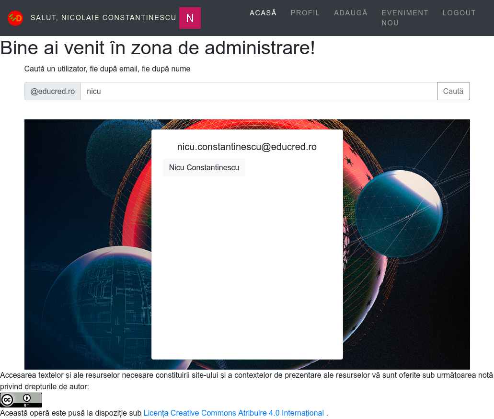

# Administrare

Colectorul RED oferă posibilitatea de a gestiona utilizatorii care și-au creat deja conturile.
Pentru a crea un cont nu trebuie făcut nimic altceva decât o autentificare cu succes folosind contul de email al platformei Educred.ro.

## Administratorii

Acest rol este dobândit prin atribuirea de către un alt administrator al aplicației.

Administratorii pot să:

- valideze o resursă,
- să trimită o resursă în zona publică,
- califică alți useri ai aplicației cu rolul de administrator, dar pot revoca acest statut,
- acordă roluri altor useri,
- atribuie utilizatorilor așa-numite *unit*-uri, care pot fi de la instituția din care face parte utilizatorul, până la un curs în care s-a înscris.

Acest rol este vârful pe care îl poate atinge un utilizator al aplicației.

Administratorii au la dispoziție accesul la secțiunea **Administrare** din meniul principal. Prin intermediul acestui meniu, se accesează zona de lucru centrată pe managementul celorlalte conturi.

## Validatorii

Utilizatorii care au dobândit rolul de validatori, pot accesa resursele unui utilizator în același mod cum o face un administrator - caută utilizatorul și accesează resursele create ale acestuia.

Validarea resurselor se va face din secțiunea **Administrare** a cărei link apare accesând mai întâi propriul profil de validator.

Accesarea fiecărei resurse va avea ca efect apariția mecanismului de validare. Bifarea sau debifarea resursei ca fiind validată fiind naturală.

### Căutarea unui user

De cele mai multe ori ai nevoie să cauți un utilizator pentru a-i modifica statutul, calificându-l și pe acesta la statutul de administrator, ori pentru a atribui roluri noi sau pentru a încadra într-un unit nou un utilizator. Pentru a găsi un utilizator, se va folosi modului de căutare în care se va introduce textul după care se va face regăsirea urmat de apăsarea butonului **Caută**. Apăsarea tastei ENTER nu are niciun efect.

În momentul în care userul, pentru care există interes, a fost găsit folosind motorul de căutare, se va da un clic pe numele acestuia, care va avea drept efect aducerea unei fișe descriptive a stării acestuia.

Suplimentar, fișa aduce și ultimele cinci contribuții la Colectorul RED.

## Roluri

Administratorii pot atribui roluri din cele prestabilite. În acest moment, cel mai important, după cel de administrator, este cel de validator.