# Încărcarea Resurselor Educaționale Deschise

<em>folosind Colectorul RED</em>
<em>Versiunea 0.8.5, aprilie, 2020</em>
Nicolaie Constantinescu <nicu.constantinescu@educred.ro>

## 1. Introducere

Acest material descrie pașii pe care persoana care contribuie cu o resursă trebuie să-i parcurgă pentru a introduce o înregistrare viabilă. Formularul dedicat expune patru pași în succesiune, care la rândul lor, fiecare necesită completarea cu informații specifice.
Completarea pașilor pentru adăugarea unei Resurse Educaționale Deschise va genera în baza de date o fișă descriptivă, iar în directorul dedicat `repo` se va constitui câte un subdirector pentru fiecare utilizator al platformei și câte un subdirector pentru fiecare resursă în parte în subdirectorul utilizatorului. Mai jos este un mic exemplu ilustrativ pentru structura unei resurse așa cum este structurată pe hard disk-ul serverului după ce s-a încheiat introducerea.

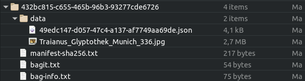

Pentru a fi mai simplu, din acest moment vom folosi în întreg documentul acronimul RED pentru Resurse Educaționale Deschise.

## 2. Preliminarii

Utilizatorii, formabili, formatori, experți e-learning și în general toți cei care interacționează cu aplicația „Colector RED”, trebuie să înțeleagă de la bun început că această aplicație are rolul de a descrie entități digitale deja existente, fie acestea documente, teste, video, simple texte, etc.

Toți cei care vor contribui cu resurse, vor trebui să aibă materialele deja pregătite, care răspund Planului-cadru de învățâmânt și care sunt gata de a fi descrise și introduse.

Colectorul RED nu este un instrument de creație. Este o aplicație de agregare a materialelor care deja există, oferind cadrul descriptiv necesar încadrării din punct de vedere al Ariei curriculare, clasei, disciplinei, competenței specifice și al rigorii științifice din domeniul educației și pedagogiei.

Este necesară o bună cunoaștere a materialului care va urma să fie descris. Pentru a aprofunda cunoașterea privind elaborarea unei Resurse Educaționale Deschisă, vă invit să parcurgeți încă o dată cursul dedicat din cadrul proiectului „CRED în educație”.

Introducerea unui RED se face prin completarea unui formular în patru pași.

## 3. Pasul 1 - Titlu și responsabilitate

Primul pas a fișei este dedicat introducerii titlului, descrierii și licenței pe care o poartă RED-ul.

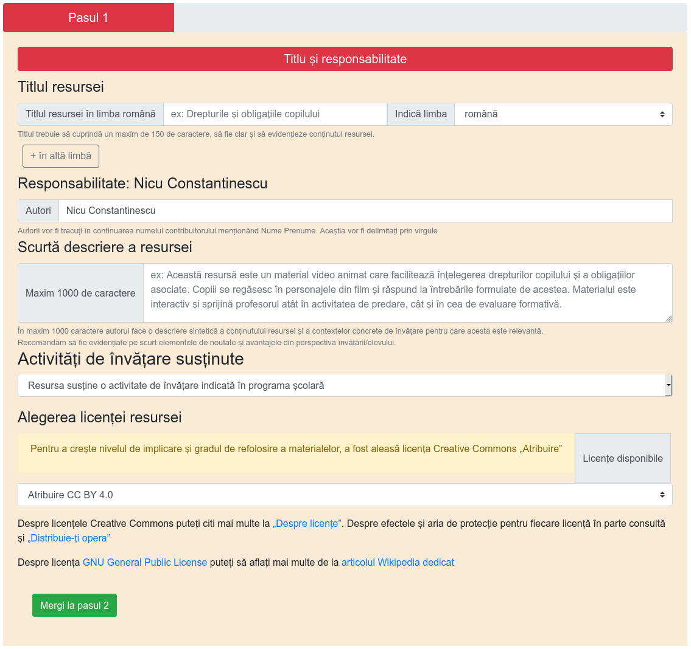

### 3.1. Titlul resursei

Titlul resursei primește informația care va denumi resursa educațională și trebuie să fie o formulare concisă în limba română.

Aplicația oferă posibilitatea introducerii titlului în mai multe limbi, dacă acest lucru este necesar imediat după menționarea titlului în limba română. Limbile minorităților sunt prezente din oficiu. Pentru a introduce un tilul în limba proprie sau într-una de largă circulație internațională, se va apăsa butonul `+ în altă limbă`.

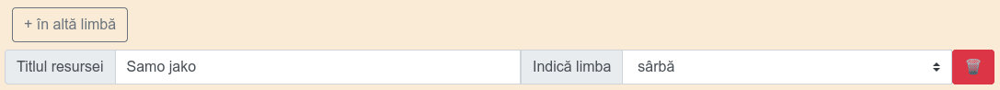

În cazul acesta, formularul prevede posibilitatea de a introduce titlul în limba minorității, urmată de selectarea limbii acesteia. Dacă se renunță la titlul în limba maternă sau a unei limbi de circulație internațională, se va apăsa pe butonul coșului de gunoi atașat câmpului, pentru a evita introducrea accidentală în înregistrare.

### 3.2. Responsabilitate (contribuitor)

Secțiunea `Responsabilitate` are un câmp care va fi completat automat cu datele persoanei care s-a autentificat șcare face contribuția. În baza adresei de email se va face generarea subdirectoarelor proprii fiecărui utilizator care contribuie cu resurse.

Persoana care introduce RED-ul în sistem este considerat a fi contribuitorul acesteia. Un contribuitor poate fi autorul RED-ului, dar în cazul în care acesta este produsul a mai multor autori, unul dintre aceștia va fi desemnat să încarce resursa în sistem, fiind cel care *contribuie* RED-ul în sistem. În acest caz, contribuitorul poate fi considerat autor colectiv.

`Autorii` unei resurse pot fi o singură persoană, un grup, un colectiv, o instituție. Autorii vor fi introduși rând pe rând, separați de virgule. Nu uitați separarea cu virgule care este esențială. Trebuie înțeleasă distincția clară dintre autori și contribuitor.

### 3.3. O scurtă descriere a resursei

În maxim 1000 de caractere, contribuitorul trebuie să descrie conținutul RED-ului. Contribuitorul va introduce toate detaliile necesare realizării unei bune corelații între titlu, descriere și conținut.

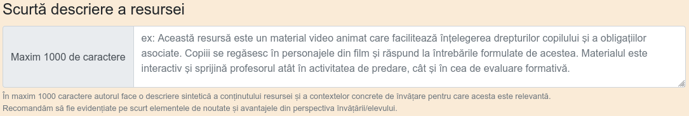

Acest element este **obligatoriu** să fie completat. Este recomandabil să fie introduse două propoziții sau maxim o frază. Acest detaliu este foarte important pentru că dincolo de aspectele ce țin de natura funcțională, acesta este și textul care va apărea în prezentarea publică a resursei.

Textul descrierii trebuie ales cu grijă pentru că va fi indexat de motorul de căutare intern al aplicației, precum și de motoarele de căutare terțe.

### 3.4. Activități de învățare susținute

Un RED este conceput, fie pentru a susține o activitate de învățare, fie pentru a complementa una. Aici trebuie încadrată resursa în funcție de cele două opțiuni oferite

Opțiuni:
- *Resursa susține o activitate de învățare indicată în programa școlară* (din oficiu)
- *Promovează o nouă activitate de învățare complementară celor din programa școlară*.

Este recomandabil să fie analizat RED-ul sub acest aspect înainte de a-l introduce.

### 3.5. Alegerea licenței resursei

Un RED poartă încă din denumire atributul care permite tuturor celor interesați reutilizarea în scopuri didactice sau chiar pentru realizarea de lucrări derivate.
Pentru a crește nivelul de implicare și gradul de refolosire a materialelor, a fost aleasă suita de licențe Creative Commons.

Prima opțiune, care este și cea selectată implicit este „Atribuire”, fiind cea mai deschisă din toate cele posibile. Despre licențele Creative Commons puteți citi mai multe la „[Despre licențe](https://creativecommons.org/licenses/?lang=ro)”. Despre efectele și aria de protecție pentru fiecare licență în parte consultă și „[Distribuie-ți opera](https://creativecommons.org/choose/?lang=ro)”

Pentru că este posibil ca unii dintre creatori să considere codul sursă a unui software ca fiind o Resursă Educațională Deschisă, am introdus și licența generică GNU - General Public License.
Despre licența [GNU General Public License](https://www.gnu.org/licenses/gpl-3.0.en.html) puteți să aflați mai multe de la [articolul Wikipedia dedicat](https://ro.wikipedia.org/wiki/Licen%C8%9Ba_Public%C4%83_General%C4%83_GNU).

## 4. Pasul 2 - Încadrarea resursei

Pasul doi adaugă informație privind **Aria curriculară**, clasa sau clasele la care poate fi folosită resursa și competențele specifice expuse de fiecare disciplină.

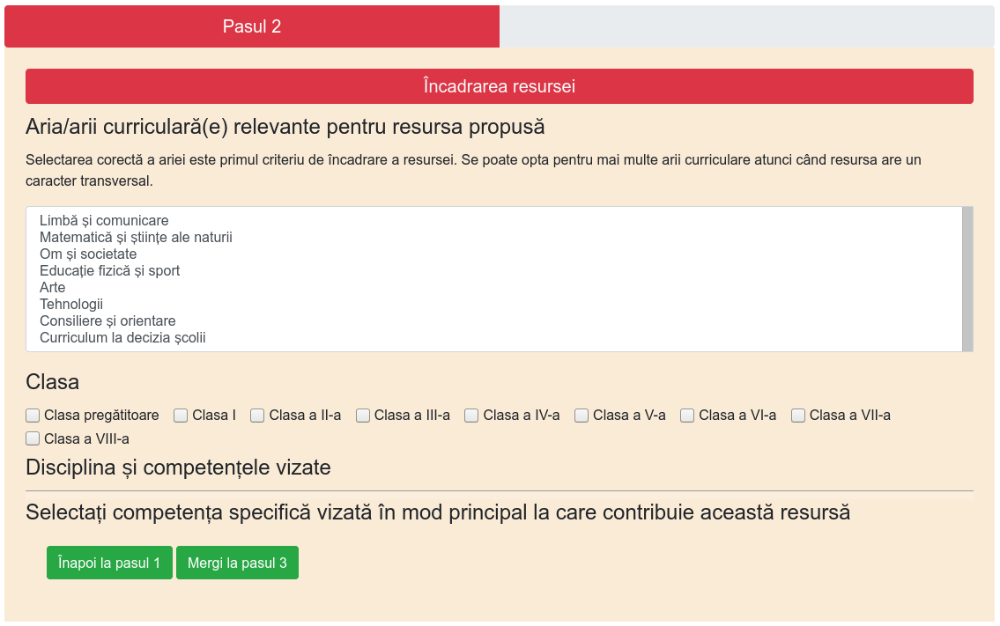

### 4.1. Aria/arii curriculară(e) relevante pentru resursa propusă

Selectarea corectă a **Ariei curriculare** este primul criteriu de încadrare al resursei. Se poate opta pentru mai multe *arii curriculare* atunci când resursa are un caracter transversal.

Acest element permite o selecție multiplă care se face selectând și/sau deselectând opțiunile ținând tasta CTRL apăsată.

Pentru mai multe detalii puteți consulta documentele:

- [Ordin privind aprobarea planurilor-cadru de învățământ pentru învățământul gimnazial](http://programe.ise.ro/Portals/1/Curriculum/Pl_cadru-actuale/Gimnaziu/OMENCS%203590_5%20apr%202016_Plan-cadru%20de%20%C3%AEnvatamant%20pentru%20gimnaziu.pdf)
- [ORDIN nr. 3.371 din 12 martie 2013 privind aprobarea planurilor-cadru de invatamant pentru invatamantul primar si a Metodologiei privind aplicarea planurilor-cadru de invatamant pentru invatamantul primar](http://programe.ise.ro/Portals/1/Curriculum/Pl_cadru-actuale/Primar/1_OMEN_3.371_12.03.2%20013%20%20privind%20aprobarea%20planurilor-cadru%20inv_primar%20si%20a%20Metodologiei%20privind%20aplicarea%20planurilor-cadru%20de%20invatamant.pdf)

Alegerea Ariei curriculare este un pas obligatoriu.

Este recomandabil să fie analizat RED-ul sub acest aspect înainte de a-l introduce.

### 4.2. Clasa

Un RED poate fi conceput pentru a fi folosit la mai multe clase diferite. Acesta este și motivul pentru care a fost lăsată opțiunea de a alege mai multe clase.

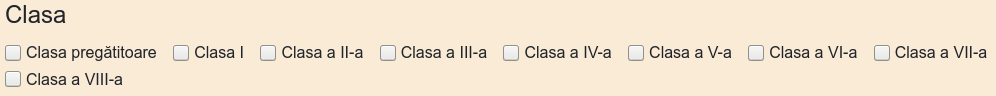

Atenție, selectarea claselor este în directă legătură cu apariția disciplinelor, care sunt expuse pentru încadrarea granulară. Bifarea unei clase are drept efect apariția disciplinelor acelor clase. Pentru acest material, am ales să nu încărcăm toate disciplinele.

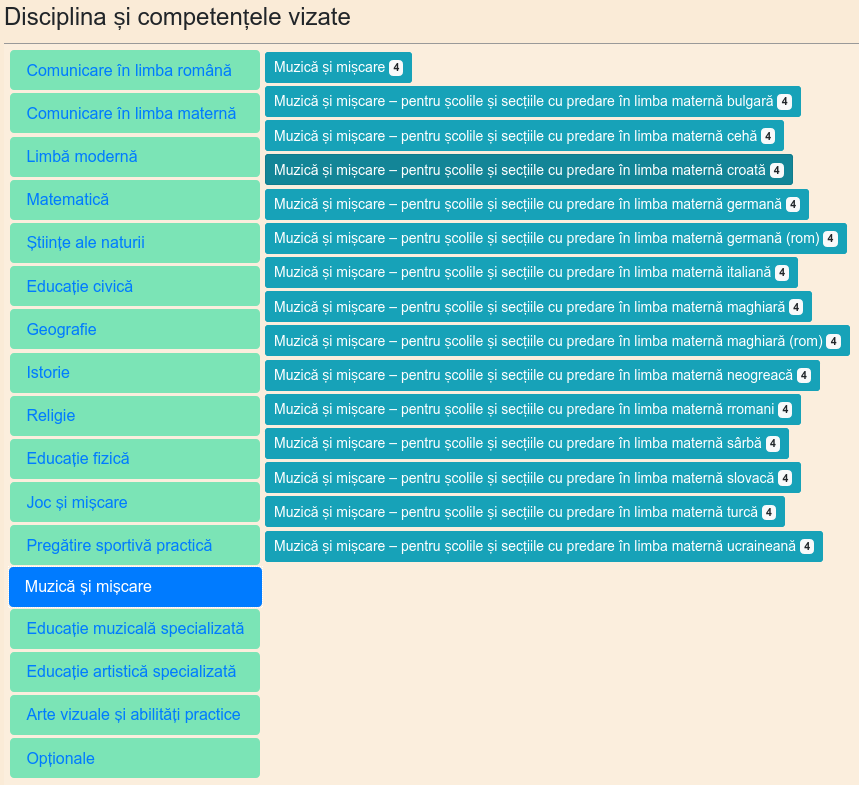

Bifarea mai multor clase, va adăuga setului existent disciplinele proprii.

### 4.3. Alege disciplinele

Selectarea disciplinei sau a mai multora încarcă competențele specifice. Atenție, în această versiune, nu toate disciplinele au seturile de date ale competențelor disponibile. Acestea vor apărea cât de curând. Pentru a avea acces la competențele specifice și implicit la activitățile proprii, cât și pentru a propune noi activități inexistente, se va alege una sau mai multe discipline.

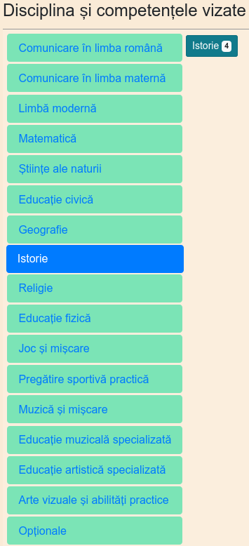

În acest moment, după ce am putut selecta disciplina sau disciplinele în cazul în care RED-ul răspunde mai multor discipline, apare opțiunea de a încărca competențele specifice așa cum apar acestea în Planul Național. Pentru fiecare dintre Competențele Specifice prezente, există posibilitatea de a consulta activitățile care sunt arondate.

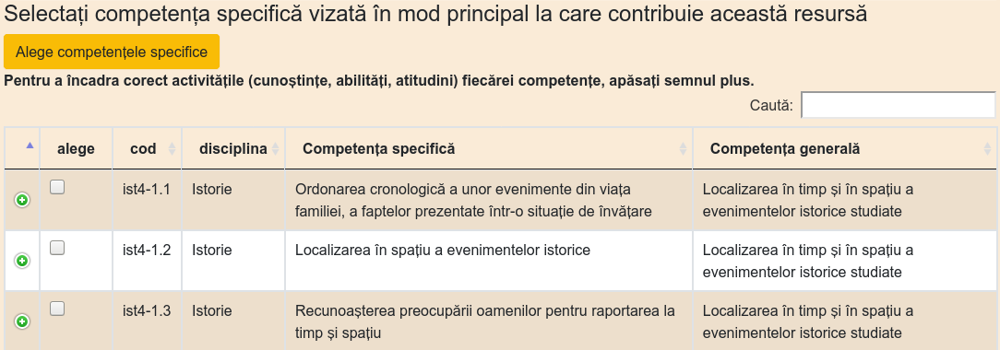

Pentru fiecare competență specifică, apăsând butonul verde, vei avea acces la cunoștințe, abilități, atitudini arondate fiecărei competențe specifice.

 Atenție, doar dacă este aleasă o activitate a unei competențe specifice, aceasta va fi selectată. O bifă dată pe titlul comptenței specifice, nu o va introduce în fișă. Selectarea uneie depinde de bifarea unei activități sau introducerea uneia noi.

Ceea ce veți observa este faptul că setul competențelor specifice este chiar cel din documentele oficiale, având în plus un cod distinct pentur fiecare competență și activitate. Aceste coduri sunt foarte importante pentru dinamica aplicației și evidența caracteristicilor unei resurse educaționale.

Activitățile pot fi selectate, iar în cazul în care se dorește ceva ce nu există, este oferită posibilitatea de a introduce una nouă.

Activitățile noi introduse, vor completa setul celor deja existente.

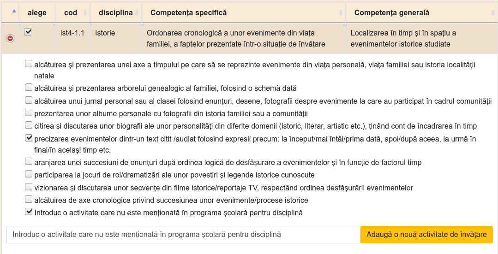

 Atenție, în varianta aceasta a aplicației, activitățile noi introduse de cel care propune Resursa Educațională Deschisă, nu se vor păstra și vor fi strict legate doar de fișa care se formează la acel moment pentru resursa individuală.

## 5. Pasul 3 - Detalii despre resursa propusă

Acest pas permite o mai mare granularitate în ceea ce privește atributele și necesitățile pentru lucrul cu toate conținuturile Resursei Educaționale Deschise propuse.

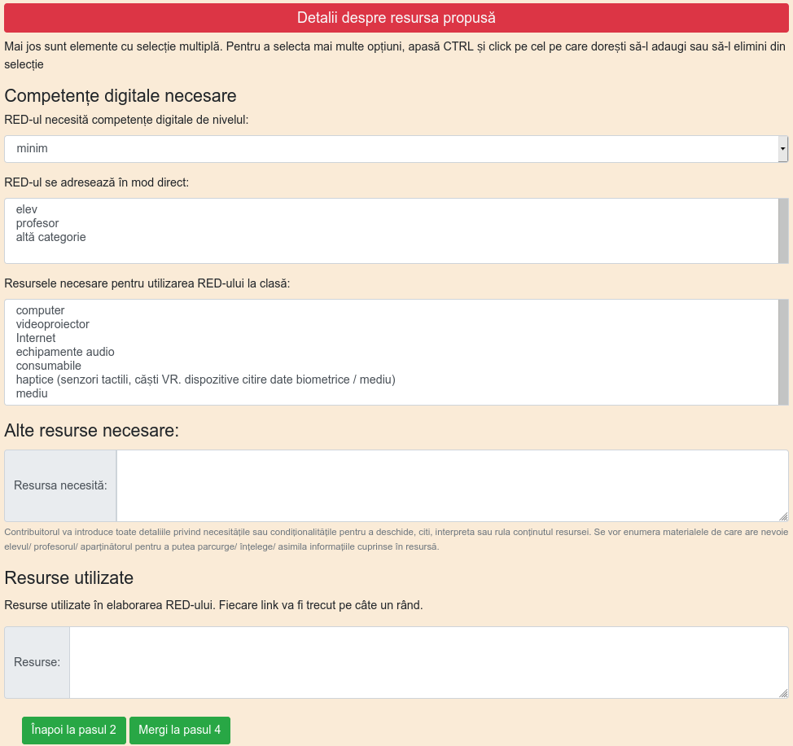

Competențele digitale necesare este un selector care permite aprecierea abilităților necesare pentru a lucra cu acestea pe trei niveluri distincte:

- minim,
- mediu,
- avansat.

Opțiunea din oficiu este `minim`.

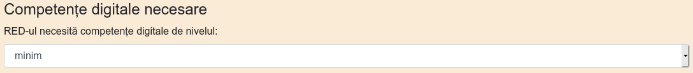

Selectorul `Red-ul se adresează în mod direct` oferă o selecție multiplă dacă acest lucru este necesar. În acest scop, se vor selecta și deselecta opțiunile, apăsând tasta CTRL și cu mouse-ul, fiind făcută selecția.

### 5.1. Alte resurse necesare

Contribuitorul va introduce toate detaliile privind necesitățile sau condiționalitățile pentru a deschide, citi, interpreta sau rula conținutul resursei.

Se vor enumera materialele de care are nevoie elevul/ profesorul/ aparținătorul pentru a putea parcurge/ înțelege/ asimila informațiile cuprinse în resursă.

### 5.2. Resurse utilizate

Acest câmp permite introducerea link-urilor către fiecare resursă digitală sau educațională care a fost folosită, remixată, interpretată pentru a o elabora pe cea prezentă. Poți privi acest câmp ca pe o listă de ingrediente a unei rețete culinare, numai că în loc de ingrediente, vom folosi linkuri către acestea. Motivul este că o parte din resursele pe care le folosești pentru a crea ceva nou sunt și ele la rândul lor cu o licență deschisă, dar acestea necesită cel puțin citarea autorului.

Pune câte un link pe rând. Un link și un titlu lângă el, face și mai valoroasă mențiunea.

## 6. Pasul 4 - Introducerea conținuturilor

Ați ajuns la zona în care este oferit un editor necesar încărcării pe server a Resursei Educaționale Deschise cu toate conținuturile necesare.

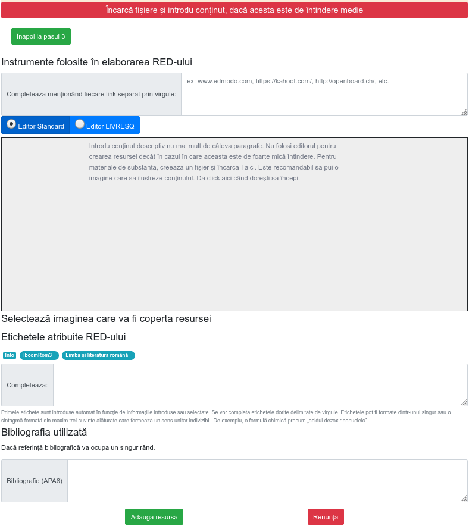

### 6.1. Detalii privind resursele electronice acceptate

Un RED poate fi un singur fișier, dar poate fi constituit din mai multe, acest aspect fiind legat de practica pedagogică specifică fiecăruia. Din acest motiv, este permisă încărcarea de documente și de imagini. Dacă aveți un videoclip, care este offline, adică nu este pe o platformă deja, dacă acesta face parte din resursă sau chiar este resursa în sine, atunci dimensiunile sale nu trebuie să depășească 20 MB. Din rațiuni economice, recomandarea pentru videoclipurile de mare dimensiune, este ca acestea deja să fie online deja și să menționați aici doar linkul, fie să existe deja în directorul Drive propriu, de unde se va genera in link accesibil public, iar acest link să fie menționat aici.
Aceste precizări sunt valabile pentru toate resursele, indiferent de natura și formatul lor.

Aceasta este zona unde pot fi aduse și completări importante prin puterea lor de clarificare a anumitor aspecte legate de înțelegerea și lucrul cu resursa în sine. Puteți să considerați că aceasta este zona în care puteți descrie în mai multe detalii ce conține materialul și cum se poate folosi... poate un mic ghid?! În acest scop, editorul permite încărcarea de fișiere tip document, text, referințe către materiale video, fragmente de cod active și fișiere de imagine în format `jpg` și `png`. Este permisă copierea și inserarea de text care conține hyperlinkuri.

### 6.2. Lucrul cu editorul din oficiu

Un posibil scenariu de completare poate implica introducerea unui fragment de text cu o imagine și un material video de pe Youtube. În acest sens, editorul oferit este foarte flexibil considerând fiecare intrare drept un bloc de conținut distinct.

În cazul fișierelor de imagine este permisă încărcarea urmată de afișarea imaginii. Este preferabil ca una dintre imaginile încărcate, să fie cea mai reprezentativă pentru resursă. În cazul în care sunt mai multe imagini asociate conținutului, acestea pot fi încărcate fără probleme concomitent cu afișarea lor.

Încărcarea pentru imagine înseamnă copy/paste a unui link a cărui element final indică o imagine sau chiar încărcarea de pe hard disk a unei imagini. Pentru fiecare imagine, se va introduce un element descriptiv în zona `Caption` afișată dedesubt. Chiar dacă nu există nicio mențiune atașată imaginii, se va trece obligatoriu numele fișierului (este necesar pentru a asigura specificitatea resursei de imagine în contextul înregistrării).

Editorul permite încărcarea de fișiere word, pdf, etc.

Toate aceste fișiere încărcate vor sta împreună în același director dedicat al resursei pentru care se constituie înregistrarea.

### 6.1.1. Instrumentele editorului

Editorul folosit pentru introducerea componentelor unei resurse este unul care oferă instrumente de bază pentru redactarea rapidă a unor fragmente de text, introducerea unor imagini, a unor fragmente de cod, a unor citări și a atașamentelor.

Totul începe cu selectarea butonului plus. Editorul folost te va obișnui cu un nou mod de lucru cu fragmentele de text, imaginile, etc.

Pentru a ne obișnui mai repede cu modul de lucru, să numim ceea ce punem cap la cap cu ajutorul lui `compoziție`. Compoziția noastră va fi alcătuită din `blocuri`. Fiecare tip de fragment digital care intră în `compoziție`, va ocupa un bloc distinct. Un bloc este de un anumit tip și poate fi modificat în funcție de tipul său.

Blocurile pot fi create într-un anumit loc, dar pot fi mutate prin acționarea modificatorilor prezenți apăsând pe cele patru puncte din colțul dreapta sus. De exemplu, putem să-l mutăm mai jos.

Sau să-l așezăm mai sus, dacă este nevoie.

Iar atunci când este necesar, putem să ștergem blocul cu totul.

Să le luăm pe rând în ordinea apariției lor în interfață.

#### 6.1.1.1. Headings

Când dorești structurarea fragmentelor de text în funcție de heading, poți alege care nivel este potrivit.

Apăsând pe cele patru puncte din colțul fiecărui bloc, poți face modificările aferente tipului de bloc.

#### 6.1.1.2. Listele

Listele pot fi ordonate cu puncte nemerotate sau cu puncte.

#### 6.1.1.3. Tabelele

Editorul permite introducerea de tabele dacă acest lucru este necesar. Din start, tabelul este de două coloane, cu două rânduri. Pentru a introduce mai multe coloane, se va face hover pe linia de coloană până apare selectorul albastru care permite introducerea uneia noi.

Același lucru este posibil și pentru rânduri pentru adăugarea lor.

#### 6.1.1.4. Fișierele de conținut

Documentele pe care deja le aveți și care conțin resursa, le puteți încărca folosind opțiunea `Attach` din meniul editorului. Imediat după încărcare fișierul este prezent în editor.

 În cazul în care atașamentul dă eroare, înseamnă că ați depășit perioada alocacă sesiunii de lucru și va trebui să vă logați din nou, reluând procedura de descriere.

#### 6.1.1.5. Fișierele de imagine

Pentru încărcarea imaginilor în editor, există un buton specializat în meniu, dar poate că cea mai rapidă cale este să executați o operațiune de *drag and drop* a unei imagini. Dacă *drag and drop* nu funcționează, încărcați imaginile folosind elementul dedicat din meniu.

Odată încărcate imaginile, vor fi disponibile din previzualizator pentru a se alege o copertă.

#### 6.1.1.6. Citate

Ultima opțiune a editorului este aceea de a introduce citate, dacă acest lucru este necesar.

#### 6.1.1.7 Videoclipuri

Copierea linkului unui videoclip de pe Youtube într-un bloc de editor, permite transformarea acestuia într-un player care permite rularea materialului video.

Odată copiat linkul, în blocul transformat în player va fi disponibil și un câmp dedicat legendei, unde se va putea introduce o descriere. Dacă se ia titlul de pe Youtube prin copiere, dați paste prin combinația de taste CTRL+SHIFT+V pentru a elimina orice formatare, care ar conduce la generarea unui bloc H1.

### 6.2. Lucrul cu editorul Livresq

În dorința de a oferi cele mai bune instrumente de realizare a Resurselor Educaționale Deschise, am realizat o integrare a accesului către Livresq prin bifarea butonului corespondent.

Va aprea o imagine cu pașii pe care trebuie să-i faceți.

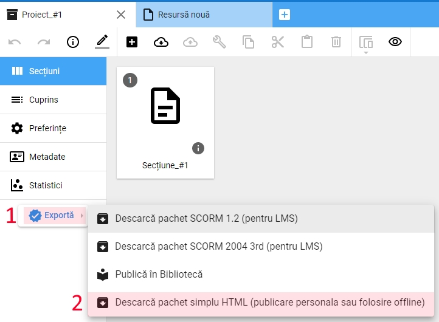

 Atenție, vi se va crea automat un cont în aplicația Livresq și veți putea începe să creați acolo o resursă.

Inevitabil, în funcție de natura și întinderea resursei pe care veți dori să o creați cu Livresq, veți putea reveni în tabul de introducre a resursei sau veți realiza că sesiunea de lucru pe red.educre.ro a expirat, ceea ce va necesita inițierea uneia noi prin logare. După ce veți fi fost parcurs din nou pașii de completare a fișei, veți putea încărca fișierul zip creat cu Livresq.

### 6.3. Încărcarea unei coperte

După ce am încărcat în editor fragmentele necesare sau am încărcat un fișier care reprezintă resursa, se va proceda la alegerea imaginii, care va ilustra resursa la momentul afisării sale în zona publică. Putem să ne gândim la această imagine ca la o copertă.

 Este foarte util să ilustrați cu o imagine sugestivă resursa pe care ați creat-o, fie alegând una din cele încărcare deja, parte a RED-ului, fie încărcați una care să fie dedicată ilustrării.

### 6.4. Cuvintele cheie

Din moment ce am făcut și acest mic pas, nu mai rămâne decât să completăm cuvintele cheie de care avem nevoie în plus față de cele generate prin completarea formularului.
Cuvintele cheie se completează delimitându-se cu virgulă, dar, atenție, fără spații între cuvintele cheie și virgule.

### 6.5. Bibliografia

La final, se va introduce bibliografia în cazul în care materialul are un aparat critic atașat. Fiecare înregitrare bibliografică va fi introdusă pe propriul rând. 

## 7. Salvarea resursei

Odată ce toți pașii au fost parcurși, se va proceda la trimiterea resursei în baza de date. Pentru acest lucru aveți la dispoziție butonul `Adaugă resursă`, iar dacă v-ați răzgândit între timp, puteți renunța de tot prin apăsarea butonului `Renunță`. Butonul `Renunță` este activ doar dacă ați încărcat vreun fișier. În cazul în care nu aveți fișiere încărcate, pentru a renunța la introducerea resursei, pur și simplu navigați la altă pagină sau dați `Logout`. 

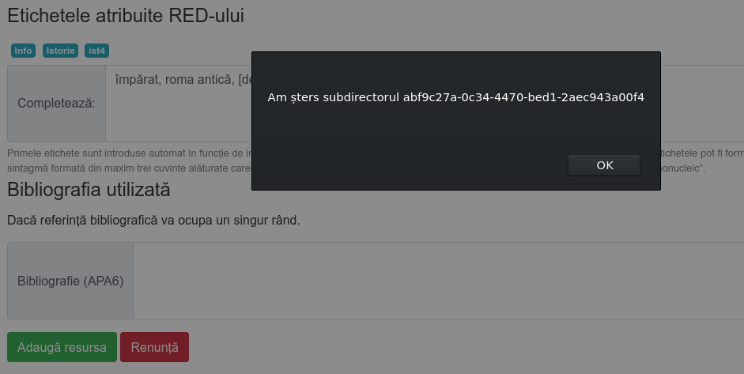

Ca efect, se vor șterge fișierele încărcate, acest lucru fiind semnalat.