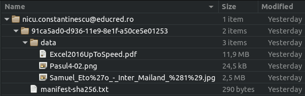
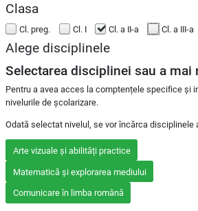
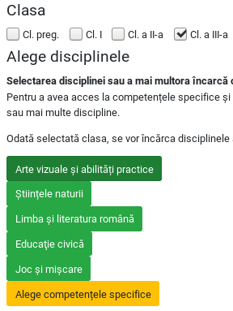
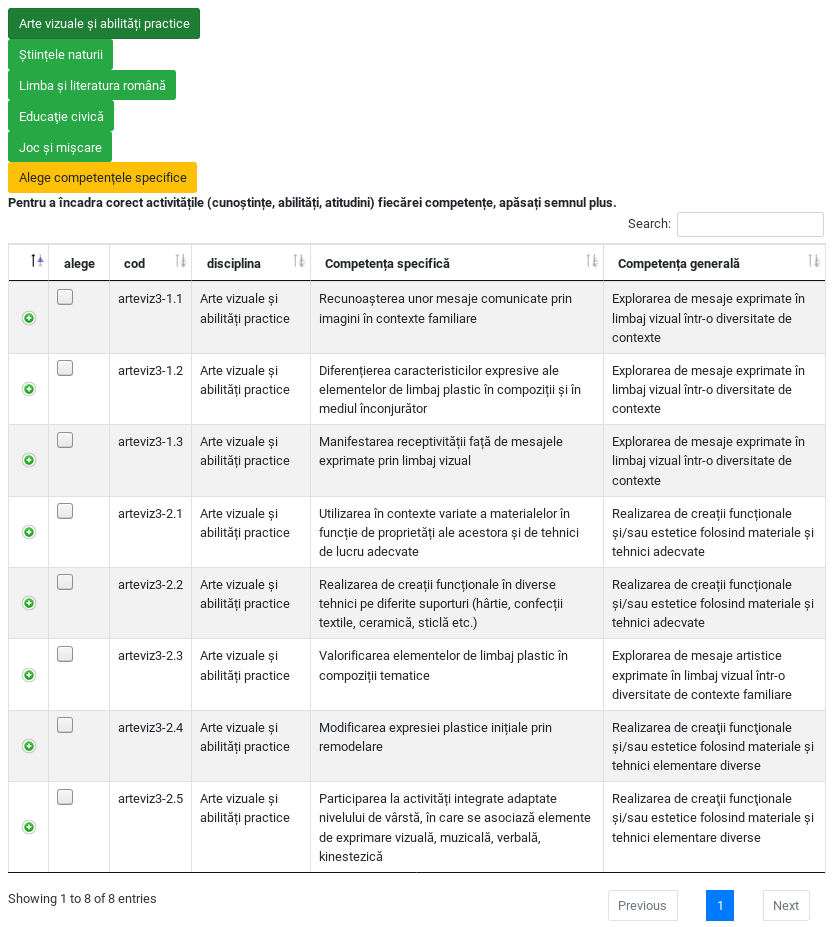
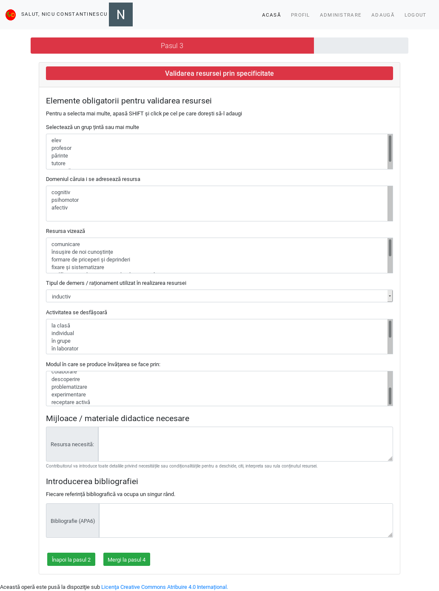

# Încărcarea Resurselor Educaționale Deschise

Acest material descrie pașii pe care persoana care contribuie cu o resursă trebuie să-i parcurgă pentru a introduce o înregistrare viabilă. Formularul dedicat expune patru pași în succesiune, care la rândul lor, fiecare expun informații specifice.
Completarea pașilor pentru adăugarea unei Resurse Educaționale Deschise va genera în baza de date o fișă descriptivă, iar în directorul dedicat `repo` se va constitui câte un subdirector pentru fiecare resursă în parte în directorul fiecărui utilizator al platformei. Mai jos este un mic exemplu ilustrativ pentru structura unei resurse așa cum este structurată pe hard disk.

Pentru a fi mai simplu, din acest moment vom folosi în întreg documentul acronimul RED pentru Resurse Educaționale Deschise.

## Pasul 1 - Titlu și responsabilitate

Primul pas a fișei este dedicat introducerii titlului, descrierii și licenței pe care o poartă REDul.

### Titlul resursei

Titlul resursei primește informația care va denumi resursa educațională. Titlul trebuie să fie o formulare concisă în limba română.

În cazul în care RED-ul va fi folosit de o minoritate, formularul prevede posibilitatea de a introduce titlul în limba minorității urmată de selectarea limbii acesteia.

### Responsabilitate (contribuitor)

În secțiunea aceasta `Nume și prenume` este un câmp care va fi completat automat cu datele persoanei care s-a autentificat și care face contribuția. Totuși, este posibilă modificarea câmpului. Acest caz nu este recomandabil pentru că una din informațiile *ascunse* necesare generării fișei în baza de date este chiar adresa de email. Aceasta mai este folosită și pentru generarea subdirectoarelor proprii fiecărui utilizator care contribuie cu resurse. Astfel, modificarea acestui câmp va conduce la un decuplaj a numelui cu adresa de email, ceea ce nu este de dorit.

Motivul pentru care câmpul este modificabil este acela al realizării unui RED în regim colaborativ, fapt ce implică introducerea tuturor colaboratorilor. Acest lucru se va face punând virgulă după primul nume și prenume, urmând introducerea tuturor colaboratorilor rând pe rând delimitați fiecare prin virgule.

Acesta este și motivul pentru care persoana care introduce RED-ul în sistem este considerat a fi contribuitor. Un contribuitor poate fi autorul RED-ului, dar în cazul în care acesta este produsul a mai multor autori, unul dintre aceștia va fi desemnat să încarce resursa în sistem, fiind cel care *contribuie* RED-ul în sistem. În acest caz, contribuitorul poate fi considerat autor colectiv.

### O scurtă descriere a resursei

În maxim 1000 de caractere, contribuitorul trebuie să descrie conținutul RED-ului. Contribuitorul va introduce toate detaliile necesare realizării unei bune corelații între titlu, descriere și conținut.

### Alegerea licenței resursei

Un RED poartă încă din denumire atributul care permite tuturor celor interesați reutilizarea în scopuri didactice sau chiar pentru realizarea de lucrări derivate.
Pentru a crește nivelul de implicare și gradul de refolosire a materialelor, a fost aleasă licența Creative Commons „Atribuire”. Despre licențele Creative Commons puteți citi mai multe la „[Despre licențe](https://creativecommons.org/licenses/?lang=ro)”. Despre efectele și aria de protecție pentru fiecare licență în parte consultă și „[Distribuie-ți opera](https://creativecommons.org/choose/?lang=ro)”

Despre licența [GNU General Public License](https://www.gnu.org/licenses/gpl-3.0.en.html) puteți să aflați mai multe de la [articolul Wikipedia dedicat](https://ro.wikipedia.org/wiki/Licen%C8%9Ba_Public%C4%83_General%C4%83_GNU).

## Pasul 2 - Încadrarea resursei

Pasul doi adaugă informație privind aria curriculară, clasa sau clasele la care poate fi folosită resursa și competențele specifice expuse de fiecare disciplină.

### Arie curriculară

Selectarea corectă a ariei curriculare este primul criteriu de încadrare a resursei. Se poate opta pentru mai multe arii curriculare atunci când resursa are un caracter transversal.

### Clasa

Un RED poate fi conceput în așa fel încât să poată fi folosit la mai multe clase diferite. Acesta este și motivul pentru care a fost lăsată opțiunea de a alege mai multe clase. Atenție, selectarea claselor este în directă legătură cu apariția disciplinelor, care sunt expuse pentru încadrarea mai granulară. Bifarea unei clase are drept efect apariția disciplinelor acelor clase. Pentru acest material, am ales să nu încărcăm toate disciplinele. Dacă nu apar toate motivul este că folosim un set de date demonstrativ, redus ca dimensiuni.

Bifarea mai multor clase, va adăuga setului existent disciplinele proprii.

### Alege disciplinele

Selectarea disciplinei sau a mai multora încarcă competențele specifice. Pentru a avea acces la competențele specifice și implicit la activitățile proprii, cât și pentru a propune noi activități inexistente, se va alege una sau mai multe discipline.

În acest moment, după ce am putul selecta disciplina sau disciplinele în cazul în care RED-ul răspunde mai multor discipline, apare opțiunea de a încărca competențele specifice așa cum apar acestea în Planul Național.

Pentru fiecare competență specifică, apăsând butonul verde, vei avea acces la cunoștințe, abilități, atitudini arondate fiecărei competențe specifice.
Acestea pot fi selectate, iar în cazul în care se dorește ceva ce nu există, este oferită posibilitatea de a introduce una nouă.

Activitățile noi introduse, vor completa setul celor deja existente.

## Pasul 3 - Validarea resursei prin specificitate

## Pasul 4

Editorul permite încărcarea de fișiere tip document și fișiere imagine.

În cazul fișierelor de imagine este permisă încărcarea cu afișarea unei singure imagini, care să fie cea mai reprezentativă pentru resursă. În cazul în care sunt mai multe imagini asociate conținutului, acestea pot fi încărcate fără probleme cu afișarea lor.

Încărcarea pentru imagine înseamnă copy/paste a unui link a cărui element final indică o imagine sau chiar încărcarea de pe hard disk a unei imagini. Pentru fiecare imagine, se va introduce un element descriptiv în zona `Caption` afișată dedesubt. Chiar dacă nu există nicio mențiune atașată imaginii, se va trece obligatoriu numele fișierului (este necesar pentru a asigura specificitatea resursei de imagine în contextul înregistrării).

Editorul permite încărcarea de fișiere word, pdf, etc.

Toate aceste fișiere încărcate vor sta împreună în același director dedicat al resursei pentru care se constituie înregistrarea.