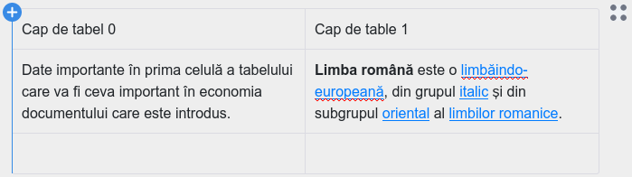
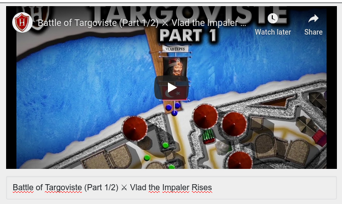

# Descrierea unei Resurse Educaționale Deschise

<em>Versiunea 0.9.8, septembrie, 2021</em>
Nicolaie Constantinescu <nicu.constantinescu@educred.ro>

## 1. Introducere

Acest material descrie pașii pe care persoana care contribuie cu o resursă trebuie să-i parcurgă pentru a introduce o înregistrare viabilă. Formularul dedicat expune patru pași în succesiune, care la rândul lor, fiecare necesită completarea cu informații specifice.

Pentru a aprofunda cunoașterea privind elaborarea unei Resurse Educaționale Deschisă (RED), vă invit să parcurgeți încă o dată cursul dedicat din cadrul proiectului „CRED în educație”.

Completarea pașilor pentru adăugarea unei Resurse Educaționale Deschise va genera în baza de date o fișă descriptivă, iar în directorul dedicat `repo` se va constitui câte un subdirector pentru fiecare utilizator al platformei și câte un subdirector pentru fiecare resursă în parte în subdirectorul utilizatorului.

În continuare vom folosi acronimul RED pentru Resursele Educționale Deschise.

### 1.1 Structura de date generată

Mai jos este un mic exemplu ilustrativ pentru structura unei resurse așa cum este structurată pe hard disk-ul serverului după ce s-a încheiat introducerea.

Pentru a fi mai simplu, din acest moment vom folosi în întreg documentul acronimul RED pentru Resurse Educaționale Deschise.

## 2. Preliminarii

Utilizatorii, formabili, formatori, experți e-learning și în general toți cei care interacționează cu aplicația „Colector RED”, trebuie să înțeleagă de la bun început că această aplicație are rolul de a descrie entități digitale deja existente, fie acestea documente, teste, video, simple texte, etc.

Creatorii de resurse care vor începe descrierea și introducerea resursei, trebuie să aibă o bună cunoaștere a documentului „Repere pentru proiectarea și actualizarea Curriculumului național” disponibil de la următorul link [https://www.edu.ro/sites/default/files/DPC_31.10.19_consultare.pdf ](https://www.edu.ro/sites/default/files/DPC_31.10.19_consultare.pdf).

Consultarea acestui document familiarizează creatorul cu cerințele descriptive ale aplicației și astfel, va fi deja familiar cu toate câmpurile prezente la fiecare pas.

Un alt lucru foarte importat este ca profesorul care va contribui cu resurse, să aibă deja conținuturile gata de a fi descrise și introduse pentru că aplicația „Colectorul RED” nu este un instrument de creație. Această aplicație este una dedicată exclusiv descrierii și încărcării materialelor care deja există. Aplicația oferă doar cadrul descriptiv necesar încadrării din punct de vedere al Ariei curriculare, clasei, disciplinei, competenței specifice și al câtorva criterii suplimentare din domeniul educației și pedagogiei.

Introducerea unui RED se face prin completarea unui formular în patru pași.

## 3. Pasul 1 - Titlu și responsabilitate

Primul pas a fișei este dedicat introducerii titlului, descrierii și a licenței pe care o poartă RED-ul.

### 3.1. Titlul resursei

Titlul resursei primește informația care va identifica resursa educațională. Aceasta trebuie formulată concisă în limba română. Indiferent de limba aleasă pentru crearea RED-ului, titlul va trebui să fie introdus în limba română.

În cazul în care limba în care este redactat conținutul resursei este alta decât română, se va putea menționa acest lucru selectând una din limbile minorităților, disponibilă din elementul de selecție de la „Indică limba”.

Aplicația oferă posibilitatea introducerii titlului în mai multe limbi, dacă acest lucru este necesar imediat după menționarea titlului în limba română. Pentru a face ast lucru, se va apăsa pe butonul „În altă limbă”, fiind oferit un câmp în care poate fi introdus titlul în limba maternă cu specificarea obligatorie a limbii minorității pentru care a fost adusă această completare.

Dacă se renunță la titlul în limba maternă sau a unei limbi de circulație internațională, se va apăsa pe butonul coșului de gunoi atașat câmpului, pentru a evita introducrea accidentală în înregistrare.

### 3.2. Responsabilitate (contribuitor)

Secțiunea `Responsabilitate` are un câmp care va fi completat automat cu datele persoanei care s-a autentificat șcare face contribuția. În baza adresei de email se va face generarea subdirectoarelor proprii fiecărui utilizator care contribuie cu resurse.

Persoana care descrie și încarcă RED-ul folosind formularul aplicației este considerată a fi *contribuitorul* acesteia. Un *contribuitor* poate fi autorul RED-ului, dar în cazul în care acesta este produsul a mai multor autori, unul dintre aceștia va fi desemnat să încarce resursa în aplicație, fiind cel care *contribuie* RED-ul. În acest caz, contribuitorul poate fi considerat autor colectiv.

Autorii unei resurse pot fi o singură persoană, un grup, un colectiv, o instituție. În cazul în care sunt mai mulți autori, vor fi introduși rând pe rând, separați de virgule. Nu uitați separarea cu virgule care este esențială. Trebuie înțeleasă distincția clară dintre autor și cel care contribuie cu resursa. De regulă, atunci când sunt mai mulți autori, unul dintre aceștia va fi desemnat să descrie și să încarce resursa.

În continuare ne vom referi la persoana care face descrierea ca fiind *contribuitorul*.

### 3.3. O scurtă descriere a resursei

În maxim 1000 de caractere, contribuitorul trebuie să descrie conținutul RED-ului. Contribuitorul va introduce toate detaliile necesare realizării unei bune corelații între titlu, descriere și conținut. În maxim 1000 caractere contribuitorul face o descriere sintetică a conținutului resursei și a contextelor concrete de învățare pentru care acesta este relevantă.
Recomandăm să fie evidențiate pe scurt elementele de noutate și avantajele din perspectiva învățării/elevului.

Textul descrierii trebuie ales cu grijă pentru că va fi indexat de motorul de căutare intern al aplicației, precum și de motoarele de căutare terțe.

### 3.4. Activități de învățare susținute

Un RED este conceput, fie pentru a susține o activitate de învățare, fie pentru a complementa una. Aici trebuie încadrată resursa în funcție de cele două opțiuni oferite

Opțiuniunile disponibile sunt următoarele:

- *Resursa susține o activitate de învățare indicată în programa școlară* (din oficiu)
- *Promovează o nouă activitate de învățare complementară celor din programa școlară*.

 Este recomandabil să fie analizat RED-ul sub acest aspect înainte de a-l introduce.
 

### 3.5. Alegerea licenței resursei

Un RED poartă chiar în denumire atributul „deschis”, fapt care permite tuturor celor interesați utilizarea și în anumite condiții reutilizarea în scopuri didactice sau chiar pentru realizarea de opere derivate. Reținem faptul că pentru orice creație umană care are suport, din punct de vedere legal, spunem că este o **operă**.
Pentru a crește nivelul de implicare și gradul de refolosire al materialelor, a fost aleasă suita de licențe Creative Commons. Această alegere este sincronizată cu opțiunile de licențiere de la nivel mondial.

Prima opțiune, care este și cea selectată implicit este „Atribuire”, fiind cea mai deschisă din toate cele posibile. Despre licențele Creative Commons puteți citi mai multe la „[Despre licențe](https://creativecommons.org/licenses/?lang=ro)”. Despre efectele și aria de protecție pentru fiecare licență în parte consultă și „[Distribuie-ți opera](https://creativecommons.org/choose/?lang=ro)”

Pentru că este posibil ca unii dintre creatori să considere codul sursă a unui software ca fiind o Resursă Educațională Deschisă, am introdus și licența generică GNU - General Public License.
Despre licența [GNU General Public License](https://www.gnu.org/licenses/gpl-3.0.en.html) puteți să aflați mai multe de la [articolul Wikipedia dedicat](https://ro.wikipedia.org/wiki/Licen%C8%9Ba_Public%C4%83_General%C4%83_GNU).

## 4. Pasul 2 - Încadrarea resursei

Pasul doi adaugă informație privind **Aria curriculară**, clasa sau clasele la care poate fi folosită resursa și competențele specifice expuse de fiecare disciplină.

### 4.1. Aria/arii curriculară(e) relevante pentru resursa propusă

Selectarea corectă a **Ariei curriculare** este primul criteriu de încadrare al resursei. Acest criteriu este obligatoriu.

 Lipsa unei selecții se va solda cu apariția unui mesaj de atenționare.
 

Se poate opta pentru mai multe *arii curriculare* atunci când resursa are un caracter transversal, dacă există astfel de cazuri.

Acest element permite o selecție multiplă care se face selectând și/sau deselectând opțiunile ținând tasta CTRL apăsată. Selecțiile multiple se pot face și folosind tasta SHIFT având primul element selectat. Se va opta pentru limita până la care se face selecția având tasta SHIFT apăsată.

Pentru mai multe detalii privind încadrarea în aria curriculară, puteți consulta următoarele documentele:

- [Ordin privind aprobarea planurilor-cadru de învățământ pentru învățământul gimnazial](http://programe.ise.ro/Portals/1/Curriculum/Pl_cadru-actuale/Gimnaziu/OMENCS%203590_5%20apr%202016_Plan-cadru%20de%20%C3%AEnvatamant%20pentru%20gimnaziu.pdf)
- [ORDIN nr. 3.371 din 12 martie 2013 privind aprobarea planurilor-cadru de invatamant pentru invatamantul primar si a Metodologiei privind aplicarea planurilor-cadru de invatamant pentru invatamantul primar](http://programe.ise.ro/Portals/1/Curriculum/Pl_cadru-actuale/Primar/1_OMEN_3.371_12.03.2%20013%20%20privind%20aprobarea%20planurilor-cadru%20inv_primar%20si%20a%20Metodologiei%20privind%20aplicarea%20planurilor-cadru%20de%20invatamant.pdf)

Reamintim faptul că alegerea *Ariei curriculare* este un pas obligatoriu.

 Este recomandabil să fie analizat RED-ul sub acest aspect înainte de a-l descrie.
 

### 4.2. Alegerea clasei,

Un RED este conceput pentru a corespunde activităților unei competențe specifice ale unui anumit an de studiu. În acest caz, aplicația oferă posibilitatea de a opta pentru o clasă.

Un RED poate fi conceput pentru a fi folosit la doi sau mai mulți ani diferiți, dacă există astfel de posibile stratificări într-un conținut al unui RED. Acesta este și motivul pentru care a fost lăsată opțiunea de a alege mai multe clase.

Atenție, selectarea claselor este în directă legătură cu apariția disciplinelor, care sunt expuse pentru încadrarea granulară. Bifarea unei clase are drept efect apariția disciplinelor acelor clase.

Selectând disciplina, vor apărea pentru cele care au mai multe opțiuni în funcție de *profilurile de formare* pentru competențele specifice vizate.

Pentru fiecare disciplină există un buton rotund, care odată apăsat, va introduce acea opțiune pentru mecanismul care încarcă datele aferente competențelor general și astfel a celor specifice cu suita lor de activități.

Bifarea mai multor clase, va adăuga setului existent disciplinele proprii.

### 4.3. Alege disciplinele

Selectarea disciplinei sau a mai multora încarcă competențele specifice. Pentru a avea acces la competențele specifice și implicit la activitățile proprii, cât și pentru a propune noi activități inexistente, se va alege una sau mai multe discipline, dacă acest lucru este conform unui caz special de lucru.

În acest moment, după ce am putut selecta disciplina sau disciplinele în cazul în care RED-ul răspunde mai multor discipline, apare opțiunea de a încărca competențele specifice așa cum apar acestea în Planul Național. De îndată ce contribuitorul a optat pentru prima disciplină, aceasta va fi evidențiată vizual printr-o etichetă deasupra panoului de selecție, iar în partea inferioară a acestuia se va activa un buton a cărui apăsare va popula dinamic un tabel ce va cuprinde mecanismele de selecție ale competențelor și activităților pentru disciplinele selectate.

 Atenție, nu apăsați butonul „Alege competențele specifice” înainte de a încheia selecția disciplinelor. Odată apăsat, nu se mai poate reveni la selectarea disciplinelor. Făcând acest lucru veți declanșa o stare de eroare și va trebui să reluați completarea formularului prin reîncărcarea paginii.
 

Pentru fiecare dintre Competențele Specifice prezente, există posibilitatea de a consulta activitățile care sunt arondate.

Pentru fiecare competență specifică, apăsând butonul verde, vei avea acces la cunoștințe, abilități, atitudini arondate fiecărei competențe specifice.

 Atenție, doar dacă este aleasă o activitate a unei competențe specifice, aceasta va fi selectată. O bifă dată pe titlul competenței specifice, nu o va introduce în fișa descrierii. Selectarea depinde de bifarea unei activități sau introducerea uneia noi.
 

Ceea ce veți observa este faptul că setul competențelor specifice este chiar cel din documentele oficiale, având în plus un cod distinct pentru fiecare competență și activitate. Aceste coduri sunt foarte importante pentru dinamica aplicației și evidența caracteristicilor unei resurse educaționale.

 Aici este necesară o mențiune importantă: bifarea competenței specifice nu va fi luată în considerare de aplicație. Este nevoie să fie bifată cel puțin o activitate, iar selecția acesteia se va face automat.
 

Activitățile pot fi selectate, iar în cazul în care se dorește ceva ce nu există, este oferită posibilitatea de a introduce una nouă. În momentul în care este exprimată opțiunea pentru prima activitate, abia atunci aplicația bifează automat și competența specifică a cărei atribut este.

Activitățile noi introduse, vor completa setul celor deja existente. Pentru a introduce o activitate nouă, se va completa cu un text care să descrie îndeajuns de bine noua activitate și apoi se va da clic pe butonul „Adaugă o nouă activitate de învățare”.

 Atenție, activitățile noi introduse de cel care propune Resursa Educațională Deschisă vor fi strict legate doar de propria fișă descriptivă. Nu vor fi disponibile și altor contribuitori.
 

Odată apăsat butonul, se va evidenția și noua activitate.

Un contribuitor poate alege oricâte competențe specifice crede că sunt acoperite prin activitățile cuprinse în conținuturile RED-ului. Nu există restricții în acest sens.

## 5. Pasul 3 - Detalii despre resursa propusă

Acest pas permite o mai mare granularitate în ceea ce privește atributele și necesitățile pentru lucrul cu RED-ul propus.

### 5.1. Competențe digitale

Competențele digitale necesare este un selector care permite aprecierea abilităților necesare pentru a lucra cu acestea pe trei niveluri distincte:

- minim,
- mediu,
- avansat.

Opțiunea din oficiu este **minim**.

### 5.2. Cui îi este adresat RED-ul

*Red-ul se adresează în mod direct* oferă o selecție multiplă dacă acest lucru este necesar. În acest scop, se vor selecta și deselecta opțiunile, apăsând tasta CTRL și cu mouse-ul, fiind făcută selecția.

### 5.3. Dependințele RED-ului

Contribuitorul va introduce toate detaliile privind necesitățile sau condiționalitățile pentru a deschide, citi, interpreta sau rula conținutul resursei.

### 5.4. Resursele online folosite

Se vor menționa aici, dacă este cazul sau dacă licența materialelor folosite o cere, toate resursele web utilizare în crearea RED-ului. Fiecare intrare va fi pe un rând propriu.

Aceste resurse online folosite pot fi de la cele statice așa cum sunt imaginile, audio, video, text, până la aplicații online de prelucrare, etc.

Fiecare resursă digitală utilizată, remixată, interpretată pentru a o elabora pe cea prezentă va fi trecută aici. Poți privi acest câmp ca pe o listă de ingrediente a unei rețete culinare, numai că în loc de ingrediente, vom folosi linkuri către acestea. Motivul este că o parte din resursele pe care le folosești pentru a crea ceva nou sunt și ele la rândul lor cu o licență deschisă, dar acestea necesită cel puțin citarea autorului.

## 6. Pasul 4 - Introducerea conținuturilor

Ați ajuns la zona în care este oferit un editor necesar încărcării pe server a Resursei Educaționale Deschise cu toate conținuturile necesare.

### 6.1. Detalii privind resursele electronice acceptate

Un RED poate fi un singur fișier, dar poate fi constituit din mai multe, acest aspect fiind legat de practica pedagogică specifică fiecăruia. Din acest motiv, este permisă încărcarea de documente și de imagini. Dacă aveți un videoclip, care este offline, adică nu este pe o platformă deja, dacă acesta face parte din resursă sau chiar este resursa în sine, atunci dimensiunile sale nu trebuie să depășească 20 MB. Din rațiuni economice, recomandarea pentru videoclipurile de mare dimensiune, este ca acestea deja să fie online deja și să menționați aici doar linkul, fie să existe deja în directorul Drive propriu, de unde se va genera un link accesibil public, iar acest link să fie menționat aici.
Aceste precizări sunt valabile pentru toate resursele, indiferent de natura și formatul lor.

Aceasta este zona unde pot fi aduse și completări importante prin puterea lor de clarificare a anumitor aspecte legate de înțelegerea și lucrul cu resursa în sine. Puteți să considerați că aceasta este zona în care puteți descrie în mai multe detalii ce conține materialul și cum se poate folosi... poate un mic ghid?! În acest scop, editorul permite încărcarea de fișiere tip document, text, referințe către materiale video, fragmente de cod active și fișiere de imagine în format `jpg` și `png`. Este permisă copierea și inserarea de text care conține hyperlinkuri.

### 6.2. Lucrul cu editorul din oficiu

Un posibil scenariu de completare poate implica introducerea unui fragment de text cu o imagine și un material video de pe YouTube. În acest sens, editorul oferit este foarte flexibil considerând fiecare intrare drept un bloc de conținut distinct.

Tot ce este necesar pentru a începe este să dai clip pe suprafața de editare, fiind returna un cursor și câteva marcaje ale instrumentelor disponibile. Plusul din partea stângă și cele patru puncte din partea dreaptă.

În cazul fișierelor de imagine este permisă încărcarea urmată de afișarea imaginii. Este preferabil ca una dintre imaginile încărcate, să fie cea mai reprezentativă pentru resursă. În cazul în care sunt mai multe imagini asociate conținutului, acestea pot fi încărcate fără probleme concomitent cu afișarea lor.

Încărcarea pentru imagine înseamnă copy/paste a unui link a cărui element final indică o imagine sau chiar încărcarea de pe hard disk a unei imagini. Pentru fiecare imagine, se va introduce un element descriptiv în zona `Caption` afișată dedesubt. Chiar dacă nu există nicio mențiune atașată imaginii, se va trece obligatoriu numele fișierului (este necesar pentru a asigura specificitatea resursei de imagine în contextul înregistrării).

Editorul permite încărcarea de fișiere word, pdf, etc.

Toate aceste fișiere încărcate vor sta împreună în același director dedicat al resursei pentru care se constituie înregistrarea.

### 6.1.1. Instrumentele editorului

Editorul folosit pentru introducerea componentelor unei resurse este unul care oferă instrumente de bază pentru redactarea rapidă a unor fragmente de text, introducerea unor imagini, a unor fragmente de cod, a unor citări și a atașamentelor.

Totul începe cu selectarea butonului plus. Editorul folosit te va obișnui cu un nou mod de lucru cu fragmentele de text, imaginile, etc.

Pentru a ne obișnui mai repede cu modul de lucru, să numim ceea ce punem cap la cap cu ajutorul lui `compoziție`. Compoziția noastră va fi alcătuită din `blocuri`. Fiecare tip de fragment digital care intră în `compoziție`, va ocupa un bloc distinct. Un bloc este de un anumit tip și poate fi modificat în funcție de tipul său.

Blocurile pot fi create într-un anumit loc, dar pot fi mutate prin acționarea modificatorilor prezenți apăsând pe cele patru puncte din colțul dreapta sus. De exemplu, putem să-l mutăm mai jos.

Sau să-l așezăm mai sus, dacă este nevoie.

Iar atunci când este necesar, putem să ștergem blocul cu totul.

Să le luăm pe rând în ordinea apariției lor în interfață.

#### 6.1.1.1. Headings

Când dorești structurarea fragmentelor de text în funcție de heading, poți alege care nivel este potrivit.

Apăsând pe cele patru puncte din colțul fiecărui bloc, poți face modificările aferente tipului de bloc.

#### 6.1.1.2. Listele

Listele pot fi ordonate cu puncte nemerotate sau cu puncte.

#### 6.1.1.3. Tabelele

Editorul permite introducerea de tabele dacă acest lucru este necesar. Din start, tabelul este de două coloane, cu două rânduri. Pentru a introduce mai multe coloane, se va face hover pe linia de coloană până apare selectorul albastru care permite introducerea uneia noi.

Același lucru este posibil și pentru rânduri pentru adăugarea lor.

#### 6.1.1.4. Fișierele de conținut

Documentele pe care deja le aveți și care conțin resursa, le puteți încărca folosind opțiunea `Attach` din meniul editorului. Imediat după încărcare fișierul este prezent în editor.

 În cazul în care atașamentul dă eroare, este posibil să fi depășit perioada alocată sesiunii de lucru și va trebui să vă logați din nou, reluând procedura de descriere. Acesta este un eveniment rar, dar posibil.
 

#### 6.1.1.5. Fișierele de imagine

Pentru încărcarea imaginilor în editor, există un buton specializat în meniu, dar poate că cea mai rapidă cale este să executați o operațiune de *drag and drop* a unei imagini. Dacă *drag and drop* nu funcționează, încărcați imaginile folosind elementul dedicat din meniu.

Odată încărcate imaginile, vor fi disponibile din previzualizator pentru a se alege o copertă.

#### 6.1.1.6. Citate

Ultima opțiune a editorului este aceea de a introduce citate, dacă acest lucru este necesar.

#### 6.1.1.7 Videoclipuri

Copierea linkului unui videoclip de pe YouTube într-un bloc de editor, permite transformarea acestuia într-un player care permite rularea materialului video.

Odată copiat linkul, în blocul transformat în player va fi disponibil și un câmp dedicat legendei, unde se va putea introduce o descriere. Dacă se ia titlul de pe Youtube prin copiere, dați paste prin combinația de taste CTRL+SHIFT+V pentru a elimina orice formatare, care ar conduce la generarea unui bloc H1.

### 6.2. Lucrul cu editorul Livresq

În dorința de a oferi cele mai bune instrumente de realizare a Resurselor Educaționale Deschise, a fost realizată o poartă de salt către mediul de editare Livresq prin bifarea butonului corespondent - „Editează cu LIVRESQ”.
Apăsând acel buton, veți ajunge într-un mediu deja pregătit pentru a pregăti RED-ul. Acesta se va deschide în propriul tab. Acest instrument vă va permite să accesați resursele deja create pentru a le descărca pe propriul calculator în vederea încărcării în Colectorul RED.

 Atenție, vi se va crea automat un cont în aplicația Livresq și veți putea începe să creați acolo o resursă.
 

Inevitabil, în funcție de natura și întinderea resursei pe care veți dori să o creați cu Livresq, veți putea reveni în tabul de introducere a resursei sau veți realiza că sesiunea de lucru pe red.educred.ro a expirat, ceea ce va necesita inițierea uneia noi prin logare. După ce veți fi fost parcurs din nou pașii de completare a fișei, veți putea încărca fișierul zip creat cu Livresq.

### 6.3. Încărcarea unei coperte

După ce am încărcat în editor fragmentele necesare sau am încărcat un fișier care reprezintă resursa, se va proceda la alegerea imaginii, care va ilustra resursa la momentul afisării sale în zona publică. Putem să ne gândim la această imagine ca la o copertă.

 Este foarte util să ilustrați cu o imagine sugestivă resursa pe care ați creat-o, fie alegând una din cele încărcare deja, parte a RED-ului, fie încărcați una care să fie dedicată ilustrării.
 

### 6.4. Cuvintele cheie

Din moment ce am făcut și acest mic pas, nu mai rămâne decât să completăm cuvintele cheie de care avem nevoie în plus față de cele generate prin completarea formularului.
Cuvintele cheie se completează delimitându-se cu virgulă, dar, atenție, fără spații între cuvintele cheie și virgule.

### 6.5. Bibliografia

La final, se va introduce bibliografia în cazul în care materialul are un aparat critic atașat. Fiecare înregitrare bibliografică va fi introdusă pe propriul rând.

## 7. Salvarea resursei

Odată ce toți pașii au fost parcurși, se va proceda la trimiterea resursei în baza de date. Pentru acest lucru aveți la dispoziție butonul `Adaugă resursă`, iar dacă v-ați răzgândit între timp, puteți renunța de tot prin apăsarea butonului `Renunță`. Butonul `Renunță` este activ doar dacă ați încărcat vreun fișier. În cazul în care nu aveți fișiere încărcate, pentru a renunța la introducerea resursei, pur și simplu navigați la altă pagină sau dați `Logout`. Ca efect, se vor șterge fișierele încărcate.
