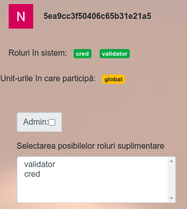

# Validarea unei resurse

## Roluri necesare

Pentru ca o Resursă Educațională Deschisă să poată fi validată este necesar ca utilizatorul desemnat să aibă rolul de validator activat.

Un validator nu este neapărat necesar să fie și administrator. Singurul rol care poate da privilegiul de administrator unui utilizator al aplicației, este administratorul. În acest context, putem adăuga faptul că admnistratorii pot face validări de resurse fără să aibă acest rol menționat explicit.

Pentru a putea valida o resursă, trebuie să fie cunoscut identificatorul unic al acesteia (de ex.: 5ec516652d28561a817476a5). Acest identificator sau listă de identificatoare trebuie să fie cunoscută validatorului înainte ca acesta să procedeze la bifarea ca validate.

## Cum se face validarea

Având rol de validator sau administrator după caz, pentru a valida o resursă, va trebui să o accesezi din propriul profil. Acest lucru înseamnă că sunteți poziționat pe calea https://red.educred.ro/profile . Pentru a deschide o resursă pentru care doriți să faceți validarea, ce trebuie făcut este să completați calea cu identificatorul (/5ec516652d28561a817476a5) resursei dorite în adresă. După completare, în bara de adresă ar trebui să aveți o cale completă către resursă, precum https://red.educred.ro/profile/5ec516652d28561a817476a5 .

În acest moment veți avea acces la întreaga descriere a Resursei Educaționale și veți putea descărca și fișierele atașate de utilizatorul pentru care se face validarea.

După ce se va face o apreciere pozitivă a conținuturilor și a descrierii, se va proceda la bifarea checkbox-ului numit *Verificată:*.

Confirmarea verificării este echivalent cu validarea valoriică a Resursei. Aceasta va intra în masa comună a RED-urilor accesibilă de pe calea http://red.educred.ro/resurse.

Nicio resursă care este validată nu va fi expusă public. Singurul rol care poate expune o resursă publicului este administratorul.

