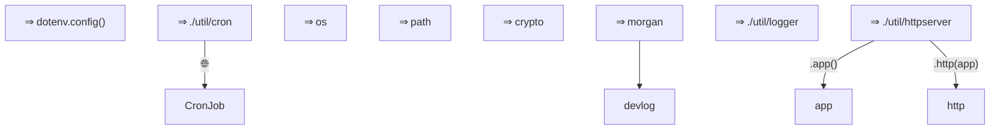
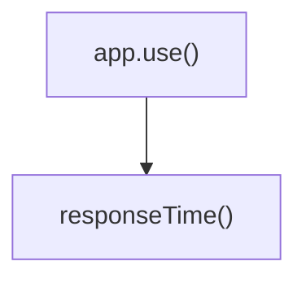
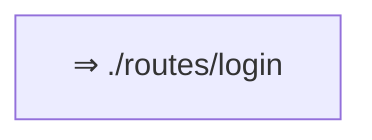

```mermaid
graph TD;
    dotenv["⇒ dotenv.config()"];
    cron["⇒ ./util/cron"]--"🌐"-->Global[CronJob];
    os["⇒ os"];
    path["⇒ path"];
    crypto["⇒ crypto"];
    morgan["⇒ morgan"]-->devlog["devlog"];
    logger["⇒ ./util/logger"];
    httpserver["⇒ ./util/httpserver"]--".app()"-->app["app"];
    httpserver["⇒ ./util/httpserver"]--".http(app)"-->http["http"];
```

Dezvoltarea lui `app` prin adăugarea de middleware-uri

```mermaid
graph TD;
    app["app.use()"] --> responseTime["responseTime()"];
```

Încărcarea unor rute neprotejate

```mermaid
graph TD;
    login["⇒ ./routes/login"]
```